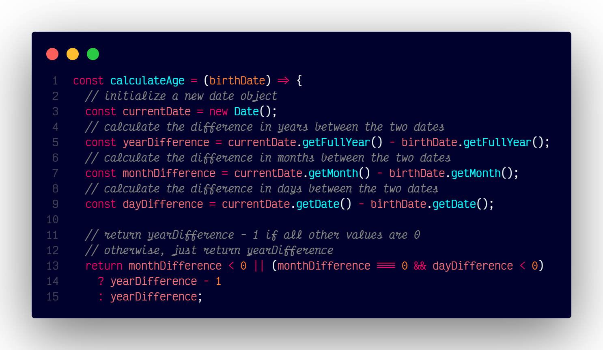

# `calculateAge()`

## Overview

Calculates the age based on a given birth date.

### Code



```js
const calculateAge = (birthDate) => {
  const currentDate = new Date();
  const yearDifference = currentDate.getFullYear() - birthDate.getFullYear();
  const monthDifference = currentDate.getMonth() - birthDate.getMonth();
  const dayDifference = currentDate.getDate() - birthDate.getDate();

  return monthDifference < 0 || (monthDifference === 0 && dayDifference < 0)
    ? yearDifference - 1
    : yearDifference;
};
```
