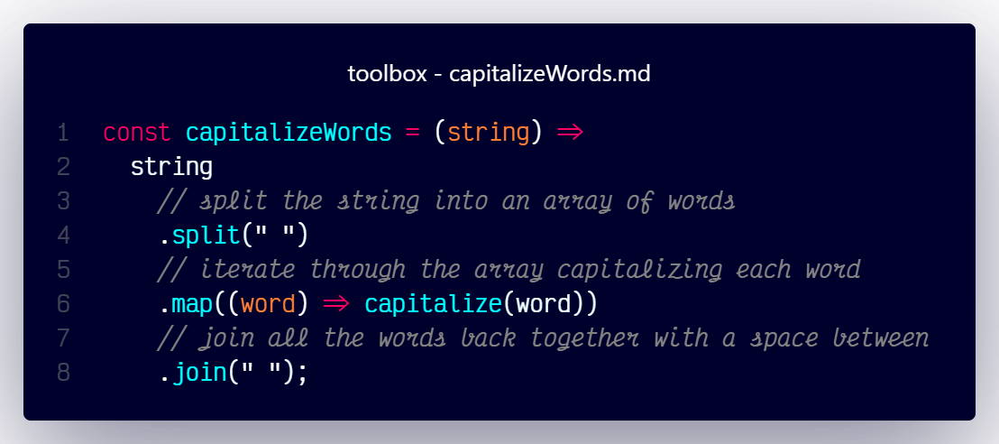

# `capitalizeWords()`



## Overview

Converts the first character of each word of a string to uppercase and returns the new string.

### Dependencies

#### Prerequisite Functions

    1. Usage of this function requires the [`capitalize()`](capitalize.md) function:

   ##### Referenced Function

   `capitalize()`

      > ```js
      > const capitalize = (string) => string.charAt(0).toUpperCase() +  string.slice(1);
      > ```

### Code

```js
const capitalizeWords = (string) =>
  string
    // split the string into an array of words
    .split(" ")
    // iterate through the array capitalizing each word
    .map((word) => capitalize(word))
    // join all the words back together with a space between
    .join(" ");
```
