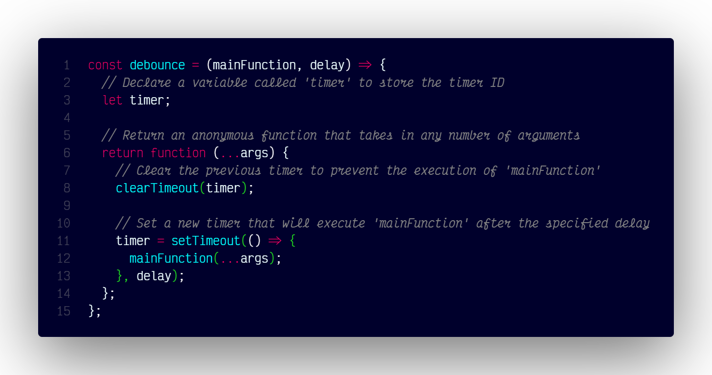

# `debounce()`

## Summary

Debouncing is a programming technique that helps to improve the performance of web applications by limiting the frequency of function calls. In this blog post, we will learn what debouncing is, why it is useful, and how to implement it in JavaScript with code examples.

### What it is

Debouncing is a way of delaying the execution of a function until a certain amount of time has passed since the last time it was called. This can be useful for scenarios where we want to avoid unnecessary or repeated function calls that might be expensive or time-consuming.

For example, imagine we have a search box that shows suggestions as the user types. If we call a function to fetch suggestions on every keystroke, we might end up making too many requests to the server, which can slow down the application and waste resources. Instead, we can use debouncing to wait until the user has stopped typing for a while before making the request.

### How to implement

There are different ways to implement debouncing in JavaScript, but one common approach is to use a wrapper function that returns a new function that delays the execution of the original function. The wrapper function also keeps track of a timer variable that is used to clear or reset the delay whenever the new function is called.

### At A Glance



#### Code

```js
const debounce = (mainFunction, delay) => {
  // Declare a variable called 'timer' to store the timer ID
  let timer;

  // Return an anonymous function that takes in any number of arguments
  return (...args) => {
    // Clear the previous timer to prevent the execution of 'mainFunction'
    clearTimeout(timer);

    // Set a new timer that will execute 'mainFunction' after the specified delay
    timer = setTimeout(() => {
      mainFunction(...args);
    }, delay);
  };
};
```

#### Using wrapping function with debounce

```js
// Define a function called 'searchData' that logs a message to the console
function searchData() {
  console.log("searchData executed");
}

// Create a new debounced version of the 'searchData' function with a delay of 3000 milliseconds (3 seconds)
const debouncedSearchData = debounce(searchData, 3000);

// Call the debounced version of 'searchData'
debouncedSearchData();
```

Now, whenever we call debouncedSearchData, it will not execute searchDataimmediately, but wait for 3 seconds. If debouncedSearchData is called again within 3 seconds, it will reset the timer and wait for another 3 seconds. Only when 3 seconds have passed without any new calls to debouncedSearchData, it will finally execute searchData.

### Real life examples:

Submit button:When you click a submit button on a website, it doesn’t send the data immediately, but waits for a few milliseconds to see if you click it again. This way, it prevents accidental double submissions and errors.

#### Elevator

When you press the button to call the elevator, it doesn’t move immediately, but waits for a few seconds to see if anyone else wants to get on or off. This way, it avoids going up and down too frequently and saves energy and time.

#### Search box

When you type something in a search box, it doesn’t show suggestions on every keystroke, but waits until you stop typing for a while. This way, it avoids making too many requests to the server and improves the performance and user experience.

### Conclusion

Debouncing is a useful technique to optimize web applications by reducing unnecessary or repeated function calls that might affect the performance or user experience. We can implement debouncing in JavaScript by using a wrapper function that returns a new function that delays the execution of the original function until a certain amount of time has passed since the last call.
