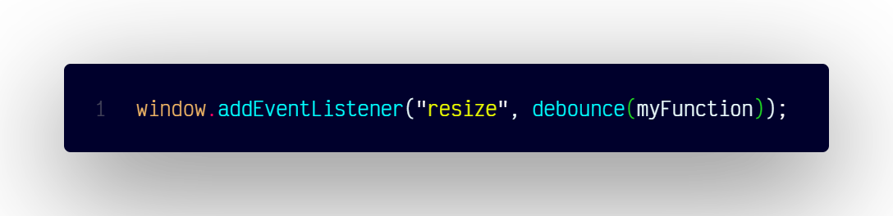

# `debounceResize()`

## Overview

Calls a function when the window resize event stops, preventing rapid multiple invocations.

### Dependencies

Usage of this function requires a `debounce()` function.

```js
const debounce = (funct, delay) => {
  let timer;
  return () => {
    clearTimeout(timer);
    timer = setTimeout(funct, delay);
  };
};
```

### Code



```js
window.addEventListener("resize", debounce(myFunction));
```

### Usage

```js
function debouncedFunction() {
  // code to be executed when window resize event stops
}
```
