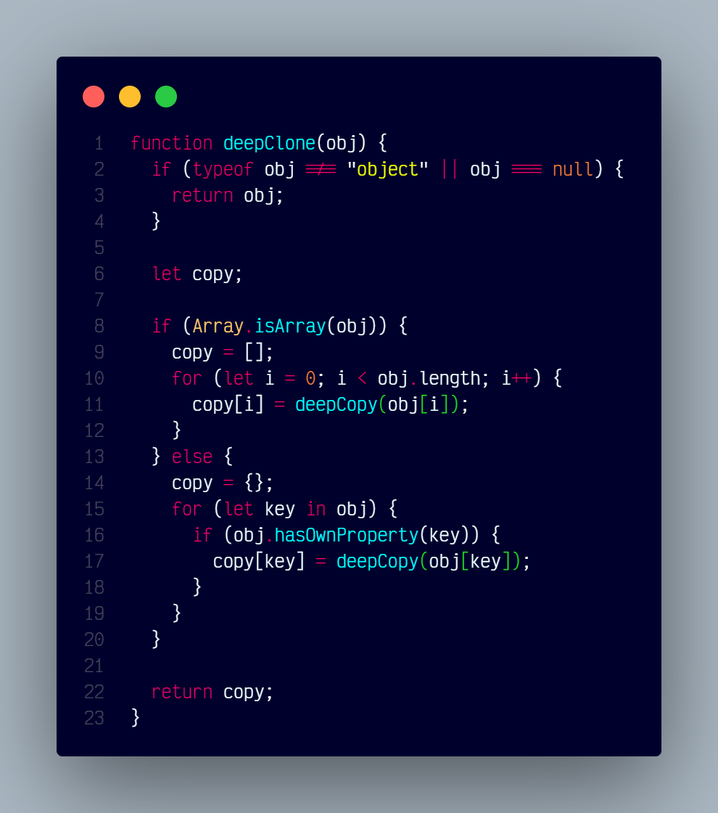

# `deepClone()`

## Overview

Creates a deep copy of an object, including nested objects and arrays.

### At A Glance



### Code

```js
const deepClone = (obj) => {
  if (typeof obj !== "object" || obj === null) {
    return obj;
  }

  let copy;

  if (Array.isArray(obj)) {
    copy = [];
    for (let i = 0; i < obj.length; i++) {
      copy[i] = deepCopy(obj[i]);
    }
  } else {
    copy = {};
    for (let key in obj) {
      if (obj.hasOwnProperty(key)) {
        copy[key] = deepCopy(obj[key]);
      }
    }
  }

  return copy;
}
```
