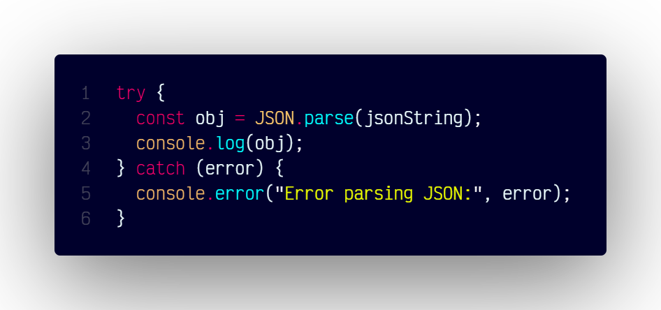

# `formatDate()`

## Overview

Formats a Date object into a string based on the specified format.

### Code



```js
try {
  const obj = JSON.parse(jsonString);
  console.log(obj);
} catch (error) {
  console.error("Error parsing JSON:", error);
}
```
