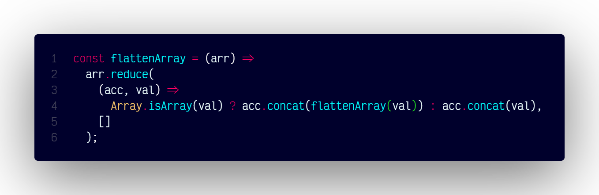

# `flattenArray()`

## Overview

Flattens a nested array into a single-level array.

### Code



```js
const flattenArray = (arr) =>
  arr.reduce(
    (acc, val) =>
      Array.isArray(val) ? acc.concat(flattenArray(val)) : acc.concat(val),
    []
  );
```
