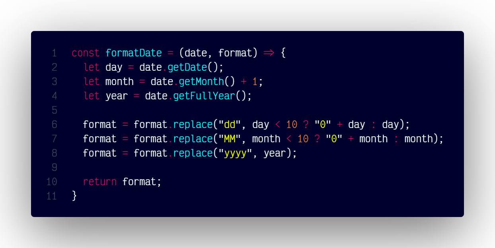

# `formatDate()`

## Overview

Formats a Date object into a string based on the specified format.

### At A Glance



### Code

```js
const formatDate = (date, format) => {
  let day = date.getDate();
  let month = date.getMonth() + 1;
  let year = date.getFullYear();

  format = format.replace("dd", day < 10 ? "0" + day : day);
  format = format.replace("MM", month < 10 ? "0" + month : month);
  format = format.replace("yyyy", year);

  return format;
}
```
