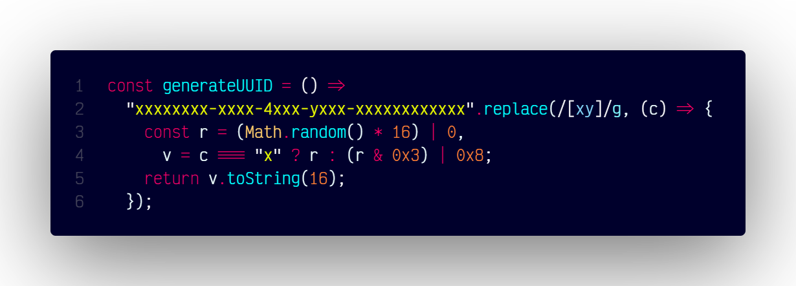

# `generateUUID()`

## Overview

Generates a universally unique identifier (UUID).

### At A Glance



### Code

```js
const generateUUID = () =>
  "xxxxxxxx-xxxx-4xxx-yxxx-xxxxxxxxxxxx".replace(/[xy]/g, (c) => {
    const r = (Math.random() * 16) | 0,
      v = c === "x" ? r : (r & 0x3) | 0x8;
    return v.toString(16);
  });
```

#### Usage

```js
const uniqueId = uuid();
console.log(uniqueId);
```
