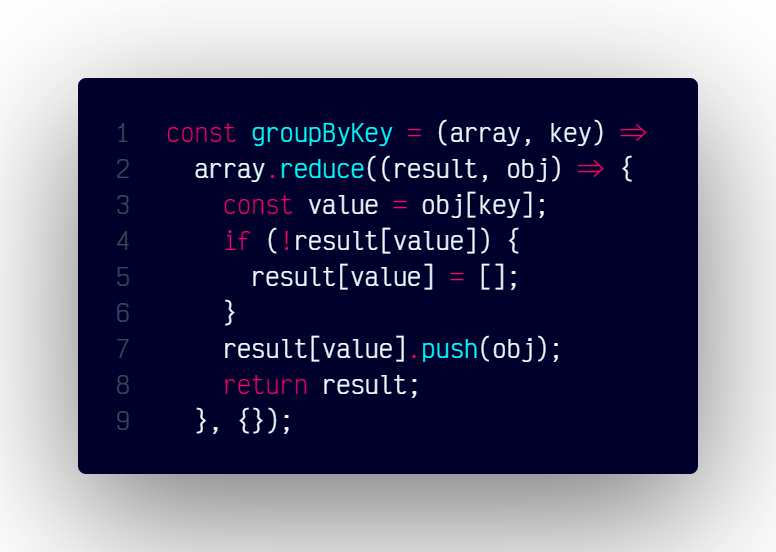

# `groupByKey()`

## Overview

Groups an array of objects by a specified key, creating an object with grouped arrays as values.

### Code



```js
const groupByKey = (array, key) =>
  array.reduce((result, obj) => {
    const value = obj[key];
    if (!result[value]) {
      result[value] = [];
    }
    result[value].push(obj);
    return result;
  }, {});
```
