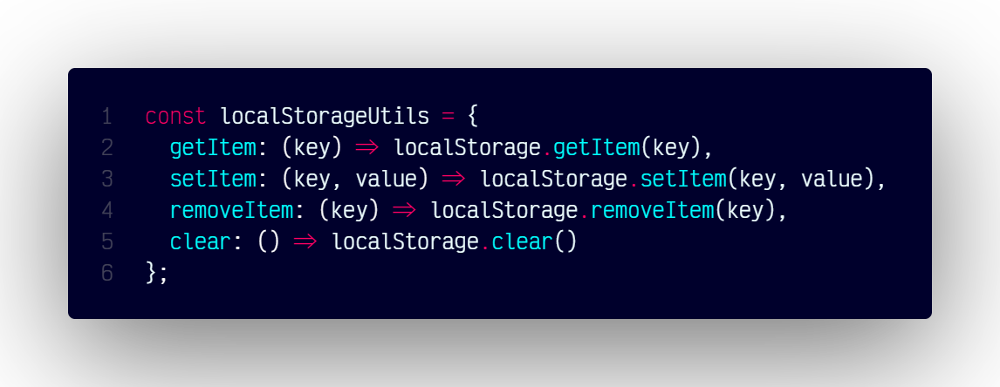

# `localStorageUtils()`

## Overview

An object containing utility functions to simplify interactions with the browser's localStorage.

### Code



```js
const localStorageUtils = {
  getItem: (key) => localStorage.getItem(key),
  setItem: (key, value) => localStorage.setItem(key, value),
  removeItem: (key) => localStorage.removeItem(key),
  clear: () => localStorage.clear()
};
```
