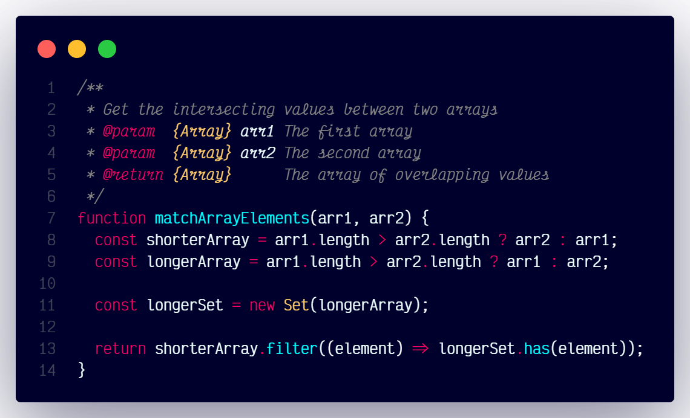

# `matchArrayElements()`



## Overview

Calculates the age based on a given birth date.

### Dependencies

None

### Code

```js
/**
 * Get the intersecting values between two arrays
 * @param  {Array} arr1 The first array
 * @param  {Array} arr2 The second array
 * @return {Array}      The array of overlapping values
 */
function matchArrayElements(arr1, arr2) {
  const shorterArray = arr1.length > arr2.length ? arr2 : arr1;
  const longerArray = arr1.length > arr2.length ? arr1 : arr2;

  const longerSet = new Set(longerArray);
  
  return shorterArray.filter((element) => longerSet.has(element));
}
```
