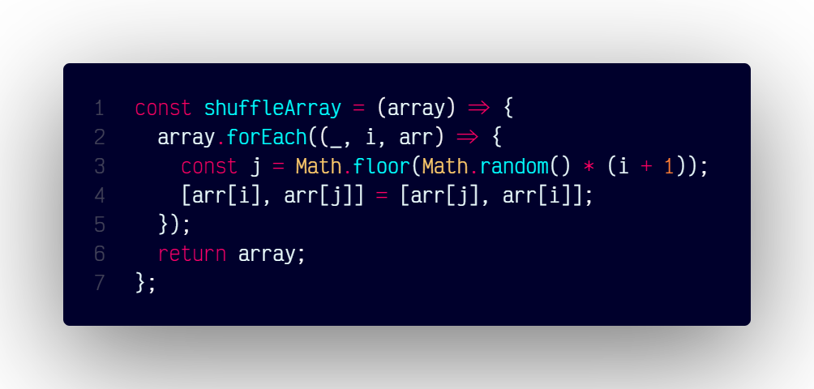

# `shuffleArray()`

## Overview

Shuffles the elements of an array randomly.

### At A Glance



### Code

```js
const shuffleArray = (array) => {
  array.forEach((_, i, arr) => {
    const j = Math.floor(Math.random() * (i + 1));
    [arr[i], arr[j]] = [arr[j], arr[i]];
  });
  return array;
};
```
