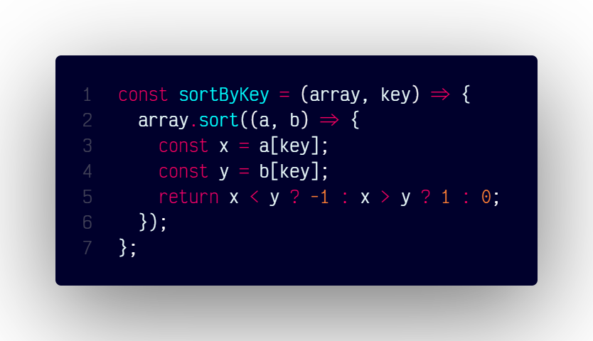

# `sortByKey()`

## Overview

Sorts an array of objects based on the values of a specified key.

### Code



```js
const sortByKey = (array, key) => {
  array.sort((a, b) => {
    const x = a[key];
    const y = b[key];
    return x < y ? -1 : x > y ? 1 : 0;
  });
};
```
