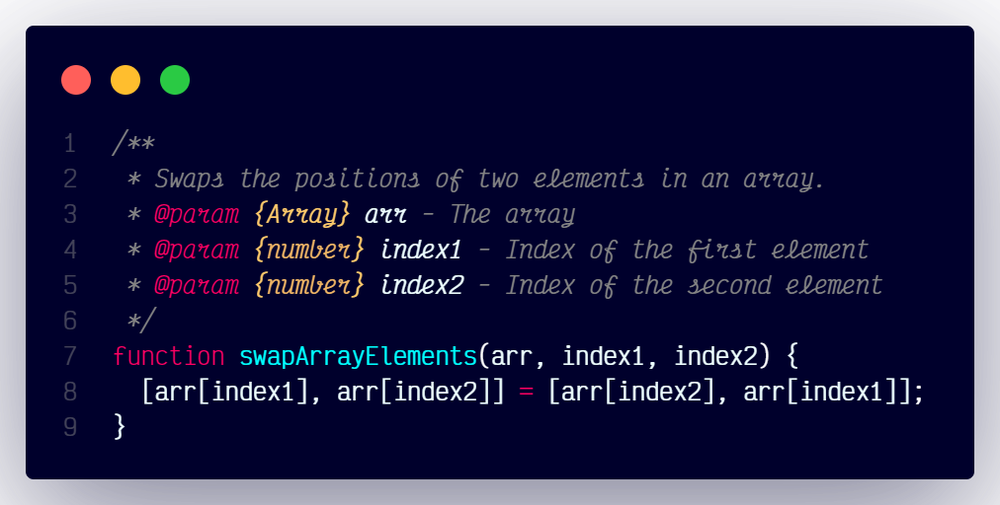

Certainly! Here's the markdown template for the `swapArrayElements()` function:

# `swapArrayElements()`



## Overview

Swaps the positions of two elements in an array.

### Dependencies

None

### Code

```js
/**
 * Swaps the positions of two elements in an array.
 * @param {Array} arr - The array
 * @param {number} index1 - Index of the first element
 * @param {number} index2 - Index of the second element
 */
function swapArrayElements(arr, index1, index2) {
  [arr[index1], arr[index2]] = [arr[index2], arr[index1]];
}
```
