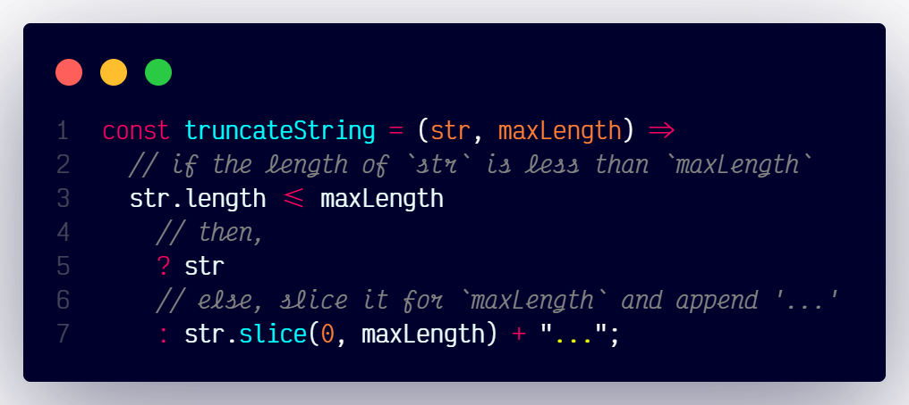

# `truncateString()`

## Overview

Truncates a string to a specified maximum length and adds ellipses if necessary.

### At A Glance



### Code

```js
const truncateString = (str, maxLength) =>
  str.length <= maxLength ? str : str.slice(0, maxLength) + "...";
```
