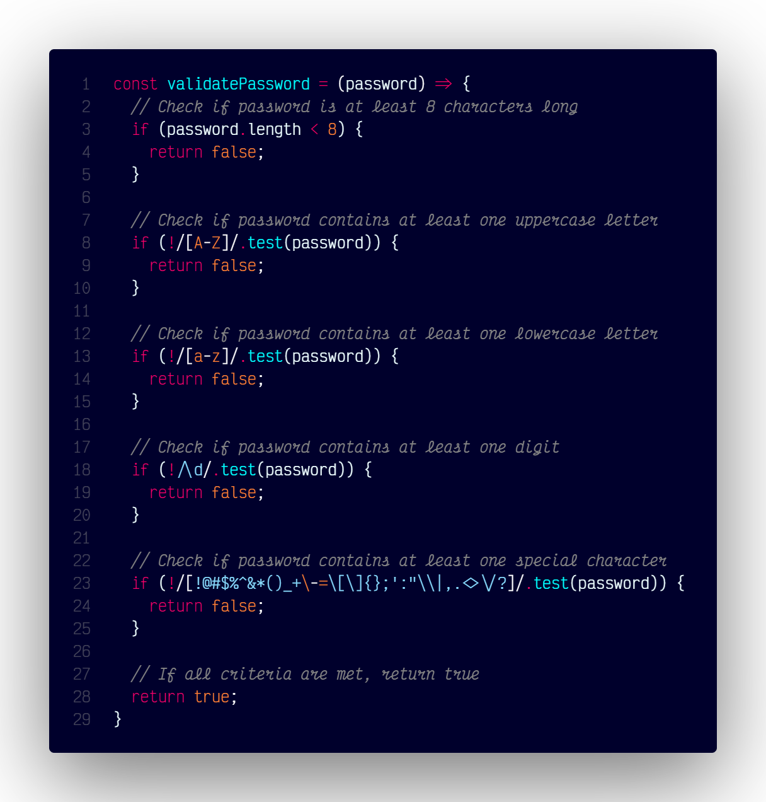

# `validatePassword()`

## Overview

Validates if a password meets common security criteria.



### Code

```js
const validatePassword = (password) => {
  // Check if password is at least 8 characters long
  if (password.length < 8) {
    return false;
  }

  // Check if password contains at least one uppercase letter
  if (!/[A-Z]/.test(password)) {
    return false;
  }

  // Check if password contains at least one lowercase letter
  if (!/[a-z]/.test(password)) {
    return false;
  }

  // Check if password contains at least one digit
  if (!/\d/.test(password)) {
    return false;
  }

  // Check if password contains at least one special character
  if (!/[!@#$%^&*()_+\-=\[\]{};':"\\|,.<>\/?]/.test(password)) {
    return false;
  }

  // If all criteria are met, return true
  return true;
}
```
